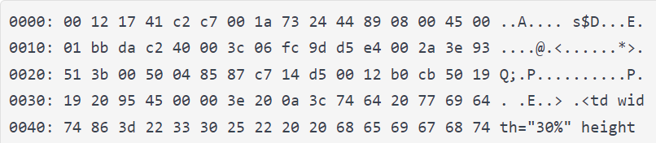

# Explorer_les_entetes_ethernet_et_IP  
  
  

## Reponse:  
  
|    |   |
|  ----  | ----  |
| L'adresse MAC source |  00 1a 73 24 44 89 |  
| L'adresse MAC destination | 00 12 17 41 c2 c7|  
| L'EtherType | 08 00 |  
  
Le contenu de **l'en-tête IP**, soit:  
|    |   |
|  ----  | ----  |
|La version du protocole|4|
|L'IHL|5|
|Le service|00|
|La longueur totale du datagramme IP (en décimal, pas en hexadécimal)|01 bb|
|L'identifiant affecté au datagramme|da c2|
|Les flags|40|
|Les offsets|00|
|La valeur du champ TTL|3c|
|Le contenu du champ protocole. En déduire le protocole encapsulé dans le
paquet IP.|06|
|Le checksum|fc 9d|
|L'adresse IP source (en format décimal)|d5 e4 00 2a|
|L'adresse IP de destination (en format décimal)|3e 93 51 3b|